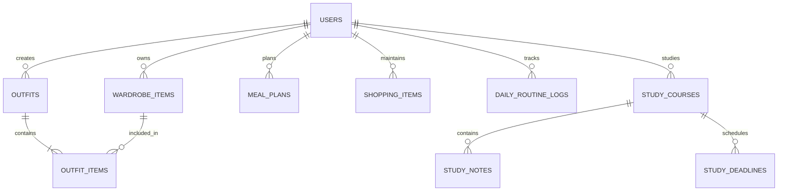

# Data Model: Atelier Visual Lifestyle & Routine Dashboard

## 1. Domain Entities & Relationships



---

## 2. Entity Definitions

### A. Módulo Closet & Looks (OOTD Studio)

#### 1. `WardrobeItem`
- **id** (`UUID`, PK): Unique identifier.
- **user_id** (`UUID`, FK -> `auth.users`): Owner reference.
- **category** (`VARCHAR(50)`): Enum (`top`, `bottom`, `shoes`, `bag`, `accessory`). Mandatory.
- **image_url** (`TEXT`): Public/presigned image URL from Cloudflare R2 / Storage.
- **tags** (`TEXT[]`): Free-form occasion/weather tags (`Trabalho`, `Casual`, `Noite`, `Frio`, `Calor`).
- **created_at** (`TIMESTAMPTZ`): Timestamp of creation.

**Validation Rules**:
- Category must be one of the permitted enums.
- `image_url` must be a valid URL string.

#### 2. `Outfit`
- **id** (`UUID`, PK): Unique identifier.
- **user_id** (`UUID`, FK -> `auth.users`): Owner reference.
- **title** (`VARCHAR(100)`): Optional look title (e.g., "Look Reunião Presencial").
- **occasion** (`VARCHAR(50)`): Occasion tag.
- **photo_url** (`TEXT`): Optional photo of the user wearing the outfit (selfie / polaroid).
- **created_at** (`TIMESTAMPTZ`): Timestamp of outfit creation / wear date.

#### 3. `OutfitItem`
- **outfit_id** (`UUID`, FK -> `outfits.id`, Composite PK): Outfit reference.
- **item_id** (`UUID`, FK -> `wardrobe_items.id`, Composite PK): Wardrobe item reference.

---

### B. Módulo Bento & Marmitas (Weekly Meal Planner)

#### 4. `MealPlan`
- **id** (`UUID`, PK): Unique identifier.
- **user_id** (`UUID`, FK -> `auth.users`): Owner reference.
- **day_of_week** (`INT`): Day of the work week (1 = Segunda, 2 = Terça, 3 = Quarta, 4 = Quinta, 5 = Sexta). Check `1 <= day_of_week <= 7`.
- **meal_type** (`VARCHAR(50)`): Enum (`Café`, `Almoço`, `Lanche`, `Jantar`).
- **title** (`VARCHAR(150)`): Name of the dish (e.g., "Bowl de Frango Grelhado com Legumes").
- **photo_url** (`TEXT`): Photo reference of the meal / lunchbox.
- **ingredients** (`TEXT[]`): Key ingredients list for auto-shopping compilation.
- **created_at** (`TIMESTAMPTZ`): Creation timestamp.

#### 5. `ShoppingItem`
- **id** (`UUID`, PK): Unique identifier.
- **user_id** (`UUID`, FK -> `auth.users`): Owner reference.
- **item_name** (`VARCHAR(150)`): Item description (e.g., "Abobrinha italiana").
- **category** (`VARCHAR(50)`): Category (`Hortifrúti`, `Geladeira`, `Despensa`, `Outros`).
- **is_completed** (`BOOLEAN`): Completion checkbox status (default `FALSE`).
- **created_at** (`TIMESTAMPTZ`): Creation timestamp.

---

### C. Módulo Rotina & Hábitos (Daily Glow)

#### 6. `DailyRoutineLog`
- **id** (`UUID`, PK): Unique identifier.
- **user_id** (`UUID`, FK -> `auth.users`): Owner reference.
- **log_date** (`DATE`): Date of record (e.g., `2026-09-02`). Unique per user per date.
- **water_cups** (`INT`): Number of cups consumed (default 0, max 20).
- **morning_habits_completed** (`TEXT[]`): Completed morning items (e.g., `["skincare", "vitamin_c", "spf50"]`).
- **evening_habits_completed** (`TEXT[]`): Completed night items (e.g., `["cleanser", "moisturizer", "reading"]`).
- **daily_photo_url** (`TEXT`): Highlight polaroid photo for this day.
- **daily_mood_quote** (`TEXT`): Inspirational quote or affirmation of the day.
- **created_at** (`TIMESTAMPTZ`): Record creation timestamp.

---

### D. Módulo Caderno Jurídico & Estudos (Legal Binder)

#### 7. `StudyCourse`
- **id** (`UUID`, PK): Unique identifier.
- **user_id** (`UUID`, FK -> `auth.users`): Owner reference.
- **name** (`VARCHAR(100)`): Course title (e.g., "Direito Constitucional").
- **professor** (`VARCHAR(100)`): Instructor name.
- **color_accent** (`VARCHAR(20)`): Pastel hex code (e.g., `#F8D7DA`, `#E0E7FF`, `#FEF3C7`).
- **progress_percentage** (`INT`): Reading progress from 0 to 100 (default 0).
- **created_at** (`TIMESTAMPTZ`): Creation timestamp.

#### 8. `StudyNote` (Micro-Fichamento)
- **id** (`UUID`, PK): Unique identifier.
- **course_id** (`UUID`, FK -> `study_courses.id`): Associated course.
- **user_id** (`UUID`, FK -> `auth.users`): Owner reference.
- **title** (`VARCHAR(150)`): Note summary title (e.g., "Controle de Constitucionalidade Difuso").
- **summary_text** (`TEXT`): Concise takeaway or key concept summary.
- **photo_url** (`TEXT`): Image reference of marked book page or lecture slide.
- **tags** (`TEXT[]`): Legal index tags (e.g., `["Art. 102", "STF", "Súmula Vinculante"]`).
- **created_at** (`TIMESTAMPTZ`): Creation timestamp.

#### 9. `StudyDeadline`
- **id** (`UUID`, PK): Unique identifier.
- **course_id** (`UUID`, FK -> `study_courses.id`): Associated course.
- **user_id** (`UUID`, FK -> `auth.users`): Owner reference.
- **title** (`VARCHAR(150)`): Deliverable title (e.g., "Petição Inicial - Estágio").
- **due_date** (`DATE`): Due date.
- **status** (`VARCHAR(30)`): Status enum (`Não iniciado`, `Em rascunho`, `Finalizado`).
- **created_at** (`TIMESTAMPTZ`): Creation timestamp.

---

## 3. Row Level Security (RLS) SQL Script

```sql
-- Extensions
CREATE EXTENSION IF NOT EXISTS "uuid-ossp";

-- Enable RLS on all tables
ALTER TABLE wardrobe_items ENABLE ROW LEVEL SECURITY;
ALTER TABLE outfits ENABLE ROW LEVEL SECURITY;
ALTER TABLE outfit_items ENABLE ROW LEVEL SECURITY;
ALTER TABLE meal_plans ENABLE ROW LEVEL SECURITY;
ALTER TABLE shopping_items ENABLE ROW LEVEL SECURITY;
ALTER TABLE daily_routine_logs ENABLE ROW LEVEL SECURITY;
ALTER TABLE study_courses ENABLE ROW LEVEL SECURITY;
ALTER TABLE study_notes ENABLE ROW LEVEL SECURITY;
ALTER TABLE study_deadlines ENABLE ROW LEVEL SECURITY;

-- Standard RLS Policies: User owns their data
CREATE POLICY "Users can manage own wardrobe" ON wardrobe_items
    FOR ALL USING (auth.uid() = user_id) WITH CHECK (auth.uid() = user_id);

CREATE POLICY "Users can manage own outfits" ON outfits
    FOR ALL USING (auth.uid() = user_id) WITH CHECK (auth.uid() = user_id);

CREATE POLICY "Users can manage own meal plans" ON meal_plans
    FOR ALL USING (auth.uid() = user_id) WITH CHECK (auth.uid() = user_id);

CREATE POLICY "Users can manage own shopping items" ON shopping_items
    FOR ALL USING (auth.uid() = user_id) WITH CHECK (auth.uid() = user_id);

CREATE POLICY "Users can manage own daily routine" ON daily_routine_logs
    FOR ALL USING (auth.uid() = user_id) WITH CHECK (auth.uid() = user_id);

CREATE POLICY "Users can manage own courses" ON study_courses
    FOR ALL USING (auth.uid() = user_id) WITH CHECK (auth.uid() = user_id);

CREATE POLICY "Users can manage own study notes" ON study_notes
    FOR ALL USING (auth.uid() = user_id) WITH CHECK (auth.uid() = user_id);

CREATE POLICY "Users can manage own deadlines" ON study_deadlines
    FOR ALL USING (auth.uid() = user_id) WITH CHECK (auth.uid() = user_id);
```
