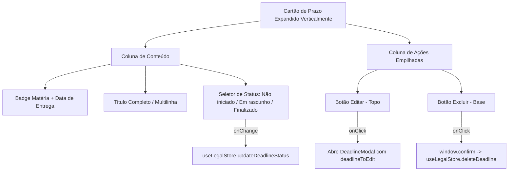

# Data Model: Ergonomia e Responsividade dos Cartões de Prazos Jurídicos

**Feature**: `005-legal-deadlines-responsive-card`  
**Phase**: Phase 1 (Design & Contracts)

---

## 1. Entidades de Domínio Existentes

### `StudyDeadline` (Prazo de Estudo / Entrega Prática)

```typescript
export type DeadlineStatus = 'Não iniciado' | 'Em rascunho' | 'Finalizado';

export interface StudyDeadline {
  id: string;
  course_id: string;
  title: string;
  due_date: string; // Formato YYYY-MM-DD
  status: DeadlineStatus;
  created_at?: string;
  user_id?: string;
}
```

---

## 2. Modelo de Apresentação Visual do Card (`DeadlineCardLayout`)

| Campo / Zona | Tipo / Controle | Propósito no Layout Vertical Móvel |
| :--- | :--- | :--- |
| **Header Metadados** | Badge + Texto Mono | Exibe o nome da matéria jurídica (`course.name`) e a data formatada (`formatDate(d.due_date)`). |
| **Título do Prazo** | Tipografia `text-sm font-semibold` | Título legível com quebra de linha permitida para acomodar até 60+ caracteres sem truncamento feio. |
| **Seletor de Status** | Menu suspenso nativo estilizado | Dropdown acessível com status `Não iniciado`, `Em rascunho` e `Finalizado`, posicionado no rodapé da coluna principal. |
| **Coluna de Ações** | Coluna vertical empilhada à direita | Agrupa botão de Editar (topo) e Excluir (base) com `min-w-[44px] min-h-[44px]` cada. |

---

## 3. Fluxo de Estado e Ações


